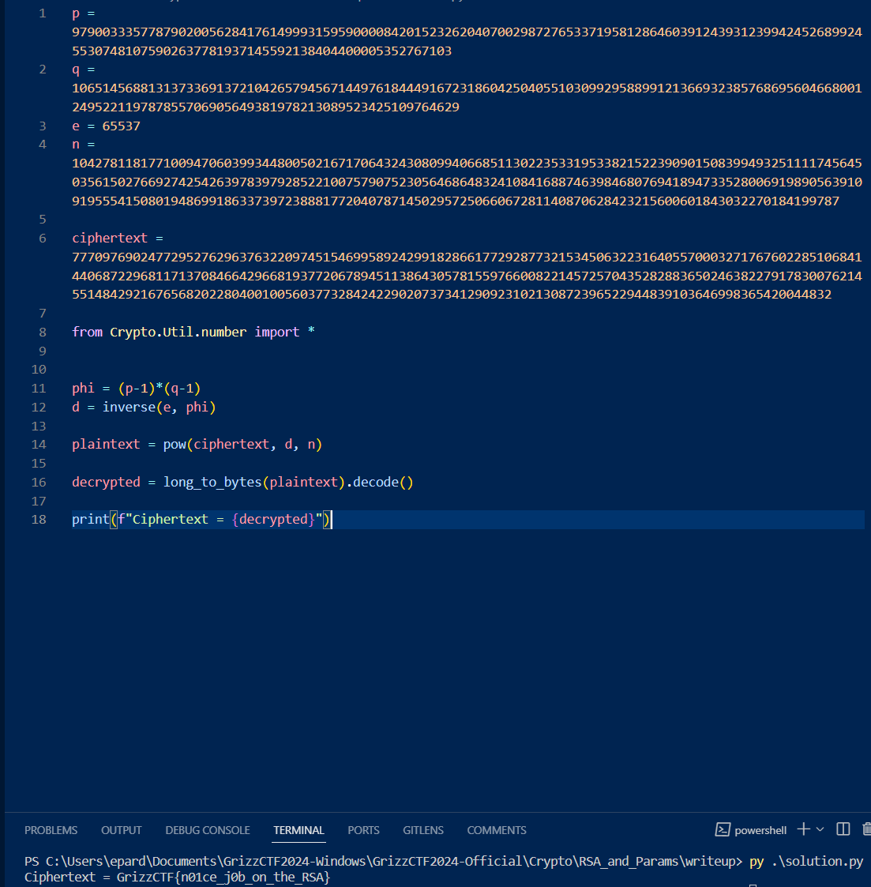

# Params and RSA (400 Points)
**Description**: Using the [RSA](https://en.wikipedia.org/wiki/RSA_(cryptosystem)) algorithm, use the given parameters to decrypt the ciphertext and retrieve the flag.
- Difficulty: Medium

## Objectives

This challenge demonstrates the practical application of RSA encryption and decryption. Participants will leverage provided RSA parameters to decipher a ciphertext, gaining insights into the workings of this fundamental cryptographic system.


## RSA Overview
The RSA algorithm, named after its creators Rivest, Shamir, and Adleman, is a cornerstone of modern cryptography, used extensively for secure communication and digital signatures. In the following section, we will break down the key components that make up RSA.

### Key Generation

1. **Choosing Primes:** Select two large, distinct prime numbers (`p` and `q`). Their size greatly influences the security of RSA; the larger the primes, the more difficult it is to break the encryption.
2. **Modulus Calculation:**  Compute the modulus `n = p * q`. This `n`. 
3. **Euler's Totient:** Calculate Euler's totient function, `φ(n) = (p - 1) * (q - 1)`.  `φ(n)` gives the number of positive integers less than `n` that are co-prime (share no common factors) with `n`.
4. **Public Exponent:** Select a public exponent `e` relatively prime to `φ(n)`. In practice, `e` is usually either `3` or `65537`. `e` is the other half of the public key `(n, e)`
5. **Private Exponent:** Determine the private exponent `d` as the modular multiplicative inverse of `e` modulo phi (`φ(n)`). Therefore, `d * e ≡ 1 (mod φ(n))`. This calculation ensures encryption and decryption operations are inverses.

### Encryption and Decryption

- **Encryption:** To encrypt a plaintext message `M` (represented as a numerical value), calculate the ciphertext `C`:
   ``` 
   C = M^e mod n 
   ```
- **Decryption:** To recover the original plaintext `M` from the ciphertext `C`, calculate:
   ```
   M = C^d mod n
   ```

### RSA Security

The RSA algorithm's strength lies in the challenge of factoring the modulus `n`. Discovering the prime factors `p` and `q` from `n` is computationally infeasible with large primes. To maintain sufficient security as processing power advances, larger key sizes must be used.

### Challenge Details

**Parameters:**

- Primes: $p$, $q$
- Public exponent: $e$
- Modulus: $n$
- Ciphertext: $C$

**Objective:**
- Decrypt the ciphertext to uncover the hidden message.

#### Solution Guide

1. **Derive the Private Key:**
   - Compute `φ(n) = (p - 1) * (q - 1)`.
   - Determine the private exponent `d` using the modular multiplcative inverse of the public exponent $e$ and $φ(n)$
```python
from Crypto.Util.number import inverse, long_to_bytes 
phi = (p-1)*(q-1)
d = inverse(e, phi)
```

2. **Decrypt the Ciphertext:**
   - Apply the decryption formula: `M = C^d mod n`.
```python
plaintext = pow(ciphertext, d, n)
```
3. **Decode the Message:**
   * Transform the decrypted numerical value `M` into its corresponding text representation to reveal the secret message.
```python
from Crypto.Util.number import inverse, long_to_bytes
decryptedPlaintext = long_to_bytes(plaintext).decode()
```
**Let's get cracking!** 


###### Full source code
```
p = 9790033357787902005628417614999315959000084201523262040700298727653371958128646039124393123994245268992455307481075902637781937145592138404400005352767103
q = 10651456881313733691372104265794567144976184449167231860425040551030992958899121366932385768695604668001249522119787855706905649381978213089523425109764629
e = 65537
n = 104278118177100947060399344800502167170643243080994066851130223533195338215223909015083994932511117456450356150276692742542639783979285221007579075230564686483241084168874639846807694189473352800691989056391091955541508019486991863373972388817720407871450295725066067281140870628423215600601843032270184199787

ciphertext = 77709769024772952762963763220974515469958924299182866177292877321534506322316405570003271767602285106841440687229681171370846642966819377206789451138643057815597660082214572570435282883650246382279178300762145514842921676568202280400100560377328424229020737341290923102130872396522944839103646998365420044832

from Crypto.Util.number import *


phi = (p-1)*(q-1)
d = inverse(e, phi)

plaintext = pow(ciphertext, d, n)

decrypted = long_to_bytes(plaintext).decode()

print(f"Ciphertext = {decrypted}")
```


###### Resources
https://brilliant.org/wiki/rsa-encryption/
