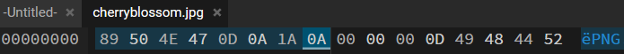

# Beyond the hex (250 Points)
**Description**: A deceitful label may attempt to fool. Trust the file's inner signature to guide your tool. Please ensure all alphabetical characters are uppercase when submitting the flag. The flag contents is the first 8 bytes total in Hex format.
- Difficulty: Easy

## Overview
In this challenge, participants are provided with a file that appears to be a JPEG image, based on its extension. However, the twist in the challenge is that the file begins with a PNG signature instead of a JPEG signature. The challenge tests the participant's understanding of file signatures and their ability to identify and manipulate them.

### Magic Bytes and File Signatures

In computer science, "magic bytes" refer to the unique sequence of bytes at the beginning of a file that identifies the file format. These bytes are also known as a "file signature." This mechanism allows software to recognize file formats even if the file extension is missing or incorrect. For example, a JPEG image file starts with the bytes `FF D8 FF`, and a PNG image file begins with `89 50 4E 47 0D 0A 1A 0A`.

#### Solution
- Use a hexeditor to view the hexdump of the file. HxD is a popular windows tool; Or, you could use `xxd`, the linux CLI tool.
- Submit the file signature as the flag.



```
GrizzCTF{89504E470D0A1A0A}
```


###### Resources
- [Magic Bytes(File signatures)](https://en.wikipedia.org/wiki/List_of_file_signatures) 
