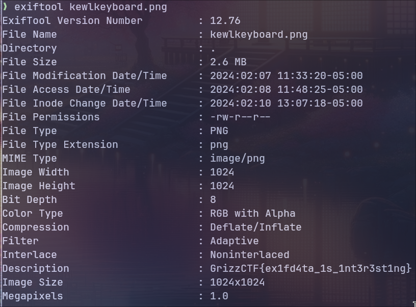

# El Exif (100 Points)
**Description**: Can you uncover the secrets hidden within the depths of `kewlkeyboard.png`? A keen eye and a good set of tools may reveal more than just pixels.

## What is exifdata?
EXIF data, which stands for Exchangeable Image File Format; is a standard that specifies the formats for images, sound, and ancillary tags used by digital cameras and other systems.

EXIF data embeds metadata within digital photos and audio files. This metadata can include a wide range of information such as:

- Date and time the photo was taken
- Camera settings: This includes ISO speed, shutter speed, aperture, white balance, and focal length.
- Camera model and manufacturer
- Location information (GPS coordinates) if the camera has GPS capability or if the photo was taken with a GPS-enabled device.
- Orientation of the photo, which helps in automatically rotating the image correctly when viewed.
- Thumbnail for previewing the image.
- Copyright information.

### Solution

```bash
exiftool src/kewlkeyboard.png | awk '/Description/' | awk {'print $3'}
```
- Running this command output's the exifdata using `exiftool`, then uses `awk` to filter & extract the flag from the data.

```
GrizzCTF{ex1fd4ta_1s_1nt3r3st1ng}
```



###### Resources
- [Exif Wiki](https://en.wikipedia.org/wiki/Exif)
- [Exiftool](https://exiftool.org/)