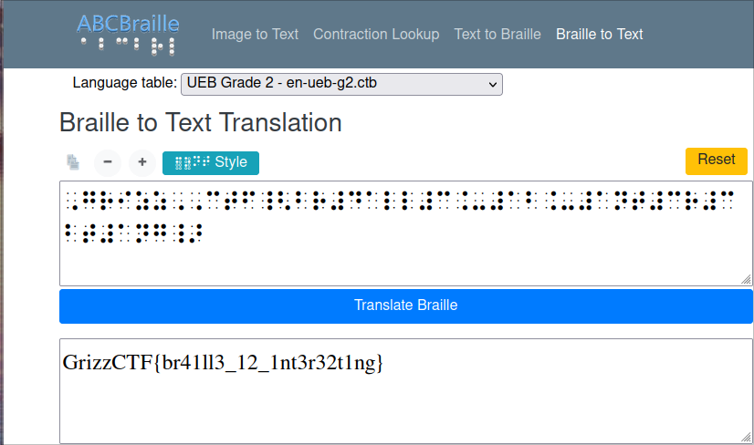

# Br4ille
[Resources](https://www.abcbraille.com/braille)
**Description**: No words
## Solution
From the above resource, simply copy and paste the braille found in `data.txt`, then use the online translator to translate the braille into plain english.

