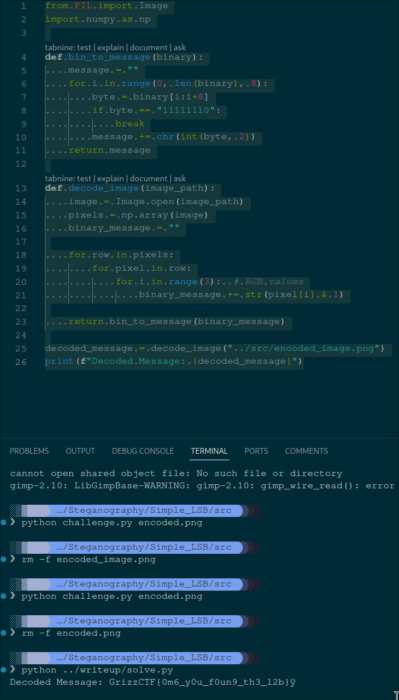

# Hidden In Plain Sight
**Description:** 

## Solution

## Uncovering the Hidden Message
In the "Hidden in Plain Sight" challenge, participants were tasked with uncovering a hidden message encoded within the pixels of an image. This write-up will explain the concept of the Least Significant Bit (LSB) steganography, how it was applied in the challenge, and provide a step-by-step guide to the solution.

## Understanding Least Significant Bit (LSB) Steganography

Steganography is the art of hiding information within something else, in this case, an image. The Least Significant Bit (LSB) technique is a popular method for image steganography due to its simplicity and effectiveness. It involves manipulating the least significant bits of pixel values in an image to encode secret messages. Since the LSB of a pixel color value has the least impact on the color, changes to it are usually imperceptible to the human eye, making it an excellent covert communication channel.

### How LSB Works

Each pixel in an image is represented by a color, which, in digital terms, is a combination of Red, Green, and Blue (RGB) values. Each of these values can range from 0 to 255, represented in binary as a 8-bit number. The idea behind LSB steganography is to replace the least significant (last) bit of one or more of these color values with the bits of the secret message.

## The Challenge

In our challenge, the secret message was encoded into an image by replacing the LSB of the RGB values of the image's pixels with the binary representation of the message. The encoding process terminated with a special binary sequence `1111111111111110` to indicate the end of the message.

### Encoding Process

1. Convert the secret message into its binary representation.
2. Iterate over each pixel's RGB values in the image.
3. Replace the LSB of each RGB value with a bit from the secret message.
4. Save the modified image, which now contains the hidden message.

### Decoding Process

To extract the hidden message, the decoding process essentially reverses the encoding steps:

1. Read the pixel data from the image.
2. Extract the LSB from each RGB value of every pixel.
3. Concatenate these bits to form a binary string.
4. Convert this binary string back into characters once the special termination sequence `1111111111111110` is encountered.

## Solution

Given the encoded image, the challenge was to apply the decoding process to reveal the hidden message.

### Step-by-Step Guide

1. **Read the Image**: Using Python and the PIL (or Pillow) library, load the provided image and access its pixel data.
2. **Extract LSBs**: Iterate through each pixel, extracting the LSB from each of the RGB values, concatenating these bits to form a binary string.
3. **Identify Message**: Convert the binary string back into text, stopping when the termination sequence is encountered.
4. **Submit the Flag**: Format the discovered message as specified and submit it as the solution to the challenge.

## Conclusion

This challenge demonstrated the effectiveness and subtlety of LSB steganography for hiding information within images. Through understanding and applying the principles of digital image processing and binary data manipulation, participants were able to uncover the hidden message and complete the challenge.
