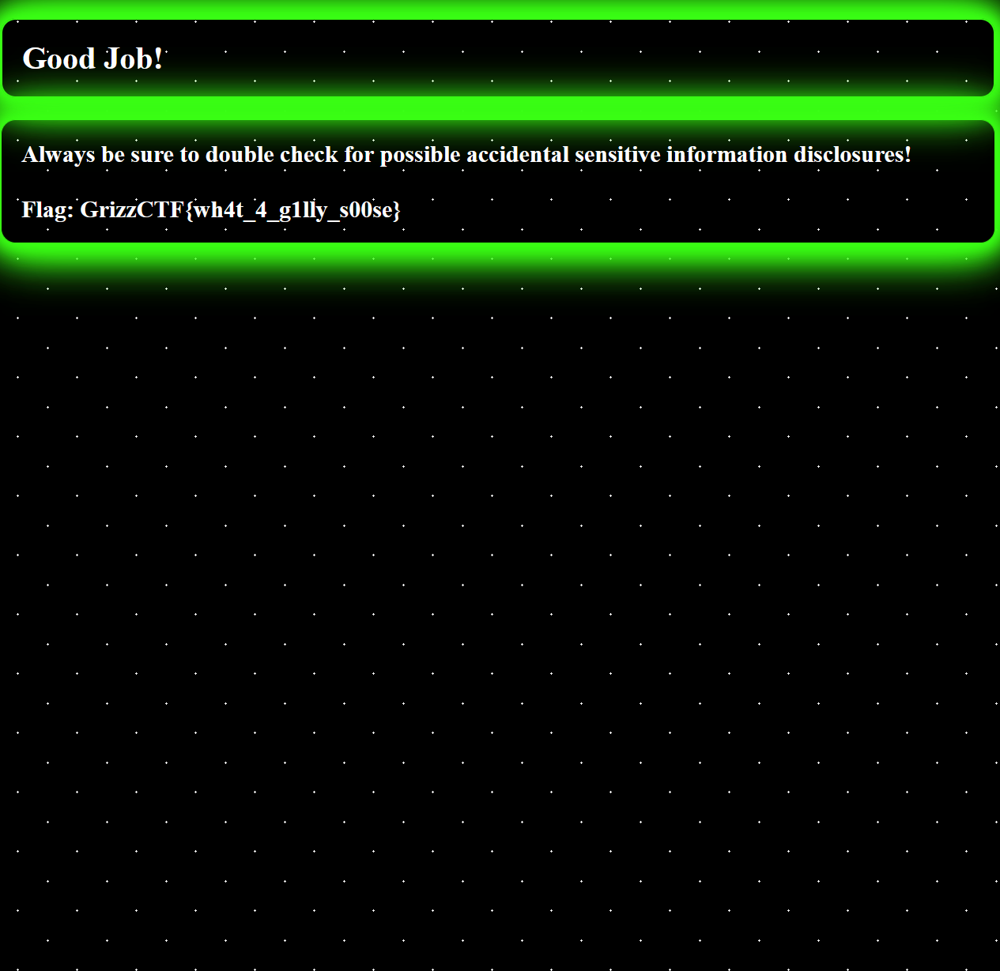

# Category: Web Exploitation
    Difficulty: Easy
## Challenge Name: Oopsies!
**Challenge Description:**
In the "Oopsies!" challenge, participants are tasked with bypassing authentication to access a protected flag as the `admin` user. This challenge tests the participant's understanding of web security, particularly in the areas of authentication and sensitive information discovery.
___
Challenge Resources:
- [Flask Documentation](https://flask.palletsprojects.com/): Flask Web Framework
- [Secure Hashing Basics](https://brilliant.org/wiki/secure-hashing-algorithms/): Understanding SHA-256
- [Web Exploitation](https://owasp.org/www-project-top-ten/): OWASP Top 10
- [Sensitive Data Exposure](https://www.manageengine.com/data-security/what-is/sensitive-data-exposure.html)
    - CTRL + U => view application source code (HTML/CSS)
##### Overview of the Steps toward the solution
**Step 1**: Analyzing the Login Mechanism

    Start by examining the login page's source code and network requests.
    Notice that the login form submits username and password fields via POST request.
___
**Step 2**: Understanding the Flask Application

    Review the provided Flask application code.
    Identify how the application manages authentication in the login route.
    Note that the password is hashed using SHA-256 before comparison.
    
___
**Step 3**: Exploring Potential Vulnerabilities

    Since the source code is available, look for any hard-coded credentials or weak points in the authentication logic.
    Look at the web pages source code, the HTML and CSS. (CTRL + U) to view source.
A hint can be found on the home page, in which a sensitive information disclosure is referenced.


Moving on to the login page:


**Step 4**: Logging in and retrieving the flag.
- Within the source code, `hidden_in_plain_sight` can be found in the comments of the `index.html` page. This is the password to login and get the flag.
___

**Step 5**: Accessing the Flag
    After successful authentication, the application redirects to a /flag route.
    On this page, the flag follows the format GrizzCTF{...}

###### Conclusion
This CTF challenge showcased the importance of always making sure to perform static analysis of your codebase before pushing to production. As you'd be quite surprised how often developer's often leave sensitive information within the comments of the HTML/CSS/JS source code. Although not very common nowadays, it is still important to always keep and eye out for and be cognisant of!

---

**One-liner solution:**
```bash
curl -X POST http://MACHINE_IP/login \
-d '{"username":"admin", "password":"hidden_in_plain_sight"}
```

---



