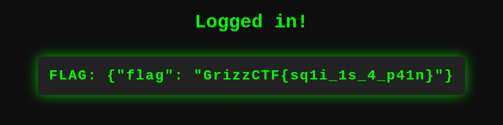

# SQL Injection
Description: Rumor has it there is a SQLi vulnerability within this application, can you bypass the login page and retrieve the flag?

In this challenge, the user is presented with a simple login form that is vulnerable to a SQL injection. The goal was to bypass the login and retrieve the flag stored in the application.

### Approach
When faced with a black box challenge like this, the first step is to analyze the application's behavior and identify potential entry points for injection. In this case, the login form stood out as the most likely candidate.

To test for SQL injection vulnerabilities, try inputting various special characters and SQL syntax into the username and password fields, observing the application's response. Common SQL injection payloads include single quotes (`'`), double quotes (`"`), semicolons (`;`), dashes (`--`), and SQL keywords like `OR`, `AND`, and `UNION`.

After experimenting with different payloads, we discovered that the application was indeed vulnerable to SQL injection. By entering the following payload into the username field, we were able to bypass the login and retrieve the flag:

' OR '1' = '1' --

Let's break down this payload:

- The single quote (`'`) closes the string literal for the username in the SQL query.
- `OR '1' = '1'` is a condition that always evaluates to true, effectively making the entire `WHERE` clause true.
- The double dashes (`--`) comment out the rest of the SQL query, ensuring that the password check is ignored.

By injecting this payload, the resulting SQL query becomes:

```sql
SELECT * FROM users WHERE username='' OR '1' = '1' -- AND password=''
```

This modified query will always return a result, regardless of the provided username and password, granting us access to the logged-in page containing the flag.


Payload:


Flag:



#### Preventing SQL Injection Vulnerabilities
To prevent SQL injection vulnerabilities, it is crucial to properly sanitize and validate user input before incorporating it into SQL queries. Some preventive measures include:

- Using parameterized queries or prepared statements to separate user input from the SQL query structure.
- Escaping special characters that have significance in SQL, such as single quotes, double quotes, and backslashes.
- Validating and filtering user input to allow only expected characters and patterns.
- Implementing least privilege principles, ensuring that the database user has minimal necessary permissions.
- Regularly updating and patching the application, framework, and database management system to address known vulnerabilities.


###### Resources
- [OWASP - SQLi Prevention Cheat Sheet](https://cheatsheetseries.owasp.org/cheatsheets/SQL_Injection_Prevention_Cheat_Sheet.html)
- [OWASP - SQLi](https://owasp.org/www-community/attacks/SQL_Injection)
- [Error based SQLi Cheat Sheet](https://github.com/kleiton0x00/Advanced-SQL-Injection-Cheatsheet/blob/main/Error%20Based%20SQLi/README.md)
- [SQL Injection Payload Cheat Sheet](https://gist.github.com/sh1nz0n/1a54391c8aa69523b30585dd62a1495c)
- [Advanced SQLi Cheat Sheet collection](https://github.com/yogeshbhandage/Advanced-SQL-Injection-Cheatsheet/blob/main/README.md)
- [PayloadsAllTheThings - SQLi Cheat Sheet](https://github.com/swisskyrepo/PayloadsAllTheThings/tree/master/SQL%20Injection)

